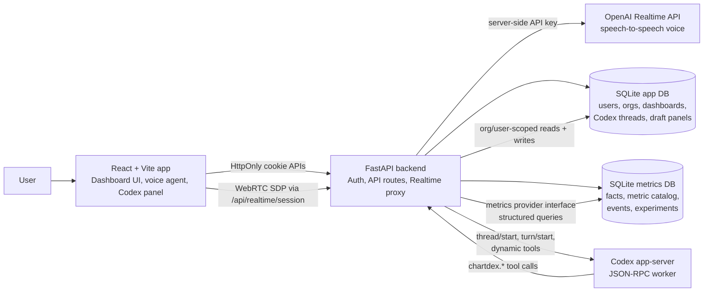

# ChartDex

Voice + Codex for eCommerce metric exploration.

ChartDex is a hackathon demo for an eCommerce analytics team. It combines a
dashboard UI, voice navigation, and backend Codex investigations over seeded
metrics data.

## Features

- Cookie-backed login with seeded demo users.
- Org dashboards for shared metrics and personal dashboards for exploration.
- Persisted dashboard state, Codex threads, turns, and draft dashboard artifacts.
- Generated SQLite metrics warehouse with realistic eCommerce facts, metric definitions, business events, experiments, and dashboard seeds.
- Interactive Recharts panels with drag-to-select time ranges.
- OpenAI Realtime voice control with app-owned tools for navigation, chart context, Codex investigations, and demo reset.
- Programmatic Codex app-server integration with scoped ChartDex tools for metric investigation and draft panel authoring.
- Markdown-rendered Codex thread history in the app, including Mermaid fenced blocks as readable diagram placeholders.
- Meaningful frontend, backend, metrics generator, Codex, and authoring tests.

## Voice Agent Examples

Use the voice button in the top bar after signing in. Good demo phrases:

- "Show me purchases by platform."
- "Open the checkout funnel."
- "Take me to promo success by code."
- "What am I looking at?"
- Drag across a line chart, then ask: "Can you investigate this?"
- "Create a dashboard for Android checkout issues."
- "Add a panel for revenue by promo code."
- "Open the latest Codex investigation."
- "Reset my demo."

The voice agent should stay brief for UI actions and delegate deeper metric analysis or dashboard authoring to Codex.

## Architecture



The metrics SQLite database is deliberately behind a provider interface. The demo provider reads from the generated local file, but the rest of the app asks for dashboards, metric metadata, and structured metric queries through that boundary. A production deployment could replace the SQLite provider with a Databricks, warehouse, semantic-layer, or internal analytics driver without changing the browser API, auth model, or Codex tool contract.

## Repository Layout

- `frontend/` - React, Vite, TypeScript, Tailwind, Recharts, Markdown rendering, voice agent integration.
- `frontend/src/vendor/realtime-voice-component/` - vendored Realtime voice component used by the browser voice agent.
- `backend/app/` - FastAPI app, auth, SQLite persistence, metrics provider, Codex app-server integration, and tool handlers.
- `backend/tests/` - backend API, auth, Codex, prompt, and dashboard authoring tests.
- `scripts/generate_demo_metrics.py` - deterministic generator for the demo metrics SQLite database.
- `tests/` - generator-level tests for the metrics data and hidden anomaly.
- `data/` - metric context and dashboard recommendation source docs.
- `docsm/` - planning docs and ExecPlans captured during the build.
- `backend/data/` - generated local SQLite files, ignored by git.

## Security Model

ChartDex is a demo app, but the security boundary is intentionally shaped like a production analytics app.

Authentication uses local username/password login for the demo. Passwords are hashed with `pwdlib`, and successful login sets a JWT access token in an `HttpOnly` cookie named `chartdex_access_token`. The browser does not read or attach bearer tokens manually; frontend requests use `credentials: "include"`.

The JWT includes `sub`, `email`, `name`, `org_id`, `role`, `iss`, `aud`, and `exp`. FastAPI dependencies verify the token signature, issuer, audience, and expiry before returning an `AuthContext`. API routes derive `org_id` and `user_id` from that context instead of trusting browser-provided org or user ids.

App state is stored separately from metrics data:

- `backend/data/app_state.sqlite3` stores orgs, users, dashboards, authored draft panels, and Codex threads.
- `backend/data/metrics.sqlite3` stores seeded metric facts and metric metadata.

Metrics access goes through the backend metrics provider, not direct route-level SQL. That keeps the demo file-backed implementation isolated from the rest of the application and gives each org a natural place to resolve its analytics driver configuration.

Dashboard and thread APIs always filter by authenticated org. Personal dashboards and Codex threads also filter by `owner_user_id`, so one user cannot read another user's personal workspace even inside the same org. Draft panel creation is limited to the current user's personal dashboards.

Codex never receives database paths, browser cookies, JWTs, OpenAI keys, or raw SQL access. When the backend starts a Codex app-server thread, it registers a small `chartdex.*` tool surface. Tool handlers receive server-side context containing only `org_id`, `user_id`, and `thread_id`, then resolve reads and writes through the same app database and metrics provider used by normal API routes. Metric queries are structured and allowlisted by metric, dimension, filter operator, date range, and result limit.

The current local JWT secret and seeded passwords are demo defaults. For production, replace local login with OIDC/JWKS verification and configure a real JWT secret, HTTPS-only cookies, CSRF protection for mutating routes, and provider-backed metrics access.

## Development

Install dependencies:

```sh
npm install
python3 -m venv .venv
. .venv/bin/activate
pip install -r backend/requirements-dev.txt
```

Configure OpenAI access for voice:

```sh
export OPENAI_API_KEY=sk-...
```

`CHARTDEX_OPENAI_API_KEY` also works. The app never sends this key to the
browser; the FastAPI backend proxies Realtime session creation.

Codex investigations use the local Codex app-server. Make sure `codex` is
installed and logged in:

```sh
codex --version
```

Run the app:

```sh
npm run dev
```

Frontend: http://localhost:5175
Backend: http://localhost:8010

Demo users:

- `admin@acme.test` / `password`
- `analyst@acme.test` / `password`

Run tests:

```sh
npm test
```

## Demo Metrics Data

In demo mode, the backend automatically creates the app database at
`backend/data/app_state.sqlite3` and the metrics database at
`backend/data/metrics.sqlite3` on startup.

To regenerate the Acme Outdoor demo metrics database manually:

```sh
python3 scripts/generate_demo_metrics.py \
  --days 180 \
  --seed 42 \
  --out backend/data/metrics.sqlite3
```

The generated SQLite file is intentionally ignored by git. Commit the generator, context, and tests only. The database includes realistic checkout facts, metric metadata, business events, experiments, UI mappings, seed dashboards, and dashboard-friendly SQL views.

Codex-facing context for the generated dataset lives in `data/metric_context.md`.

## Demo 

https://www.loom.com/share/1eaa9431cbbe4df79d261c5e7cc6c0ac

1. Sign in as `admin@acme.test`.
2. Ask voice to show "purchases by platform"; it should navigate to Revenue Overview.
3. Drag-select a dip in Checkout Conversion Over Time.
4. Ask voice: "Can you investigate this?"
5. Open the Codex thread and show the Markdown investigation.
6. Ask voice to "reset my demo" before recording another take.

